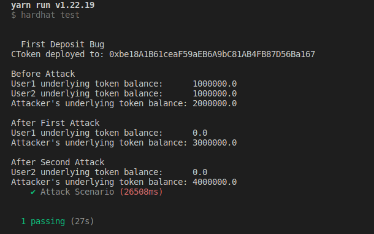

# First Deposit Bug

The CToken is a yield bearing asset which is minted when any user deposits some units of
`underlying` tokens. The amount of CTokens minted to a user is calculated based upon
the amount of `underlying` tokens user is depositing.

As per the implementation of CToken contract, there exist two cases for CToken amount calculation:

1. First deposit - when `CToken.totalSupply()` is `0`.
2. All subsequent deposits.

Here is the actual CToken code (extra code and comments clipped for better reading):

```solidity
function exchangeRateStoredInternal() virtual internal view returns (uint) {
    uint _totalSupply = totalSupply;
    if (_totalSupply == 0) {
        return initialExchangeRateMantissa;
    } else {
        uint totalCash = getCashPrior();
        uint cashPlusBorrowsMinusReserves = totalCash + totalBorrows - totalReserves;
        uint exchangeRate = cashPlusBorrowsMinusReserves * expScale / _totalSupply;
        return exchangeRate;
    }
}

function mintFresh(address minter, uint mintAmount) internal {
    // ...
    Exp memory exchangeRate = Exp({mantissa: exchangeRateStoredInternal()});

    uint actualMintAmount = doTransferIn(minter, mintAmount);

    uint mintTokens = div_(actualMintAmount, exchangeRate);

    totalSupply = totalSupply + mintTokens;
    accountTokens[minter] = accountTokens[minter] + mintTokens;
    // ...
}
```

## The Bug

The above implementation contains a critical bug which can be exploited to steal funds of
initial depositors of a freshly deployed CToken contract.

As the exchange rate is dependent upon the ratio of CToken's totalSupply and underlying token
balance of CToken contract, the attacker can craft transactions to manipulate the exchange rate.

Steps to attack:

1. Once the CToken has been deployed and added to the lending protocol, the attacker mints the 
smallest possible amount of CTokens.

2. Then the attacker does a plain `underlying` token transfer to the CToken contract, artificially inflating the `underlying.balanceOf(CToken)` value.

    Due to the above steps, during the next legitimate user deposit, the `mintTokens` value for
the user will become less than `1` and essentially be rounded down to `0` by Solidity.
Hence the user gets `0` CTokens against his deposit and the CToken's entire supply is held by the Attacker.

3. The Attacker can then simply `reedem` his CToken balance for the entire `underlying` token balance of the
CToken contract.

The same steps can be performed again to steal the next user's deposit.

It should be noted that the attack can happen in two ways:

- The attacker can simply execute the Step 1 and 2 as soon as the CToken gets added to the lending protocol.
- The attacker watches the pending transactions of the network and frontruns the user's deposit transaction by executing Step 1 and 2 and then backruns it with Step 3. 

## Impact
A sophisticated attack can impact all user deposits until the lending protocols owners and users are notified and contracts are paused. Since this attack is a replicable attack it can be performed continuously to steal the deposits of all depositors that try to deposit into the CToken contract.

The loss amount will be the sum of all deposits done by users into the CToken multiplied by the underlying token's price.

Suppose there are `10` users and each of them tries to deposit `1,000,000` underlying tokens into the CToken contract. Price of underlying token is `$1`.

`Total loss (in $) = $10,000,000`


## Proof of Concept
A working PoC is present at [test/Attack.ts](test/Attack.ts). Sufficient comments are written to explain the flow of attack and its impact.

#### Steps to run PoC:
1. Clone this repo.
2. Run `yarn install`.
3. Create a `.env` file similar to the already present `.example.env` file.
4. Run `yarn simulate`.

Output: 



Node version used - v16.17.0

## The Fix
The fix to prevent this issue would be to enforce a minimum deposit that cannot be withdrawn. This can be done by minting small amount of CToken units to `0x00` address on the first deposit.

```solidity
function mintFresh(address minter, uint mintAmount) internal {
    // ...
    Exp memory exchangeRate = Exp({mantissa: exchangeRateStoredInternal()});

    uint actualMintAmount = doTransferIn(minter, mintAmount);

    uint mintTokens = div_(actualMintAmount, exchangeRate);

    /// THE FIX
    if (totalSupply == 0) {
        totalSupply = 1000;
        accountTokens[address(0)] = 1000;
        mintTokens -= 1000;
    }

    totalSupply = totalSupply + mintTokens;
    accountTokens[minter] = accountTokens[minter] + mintTokens;
    // ...
}
```

Instead of a fixed `1000` value an admin controlled parameterized value can also be used to control the burn amount on a per CToken basis.
